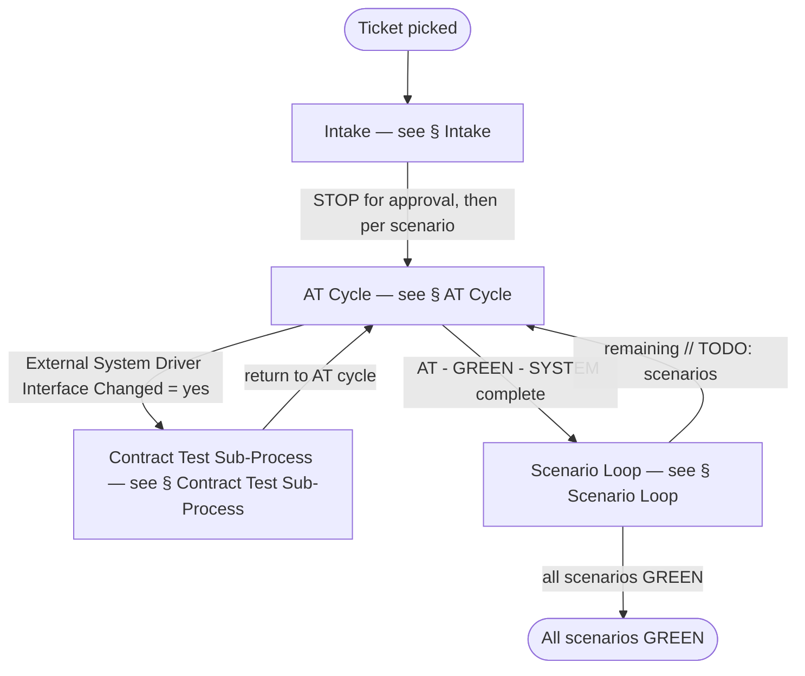
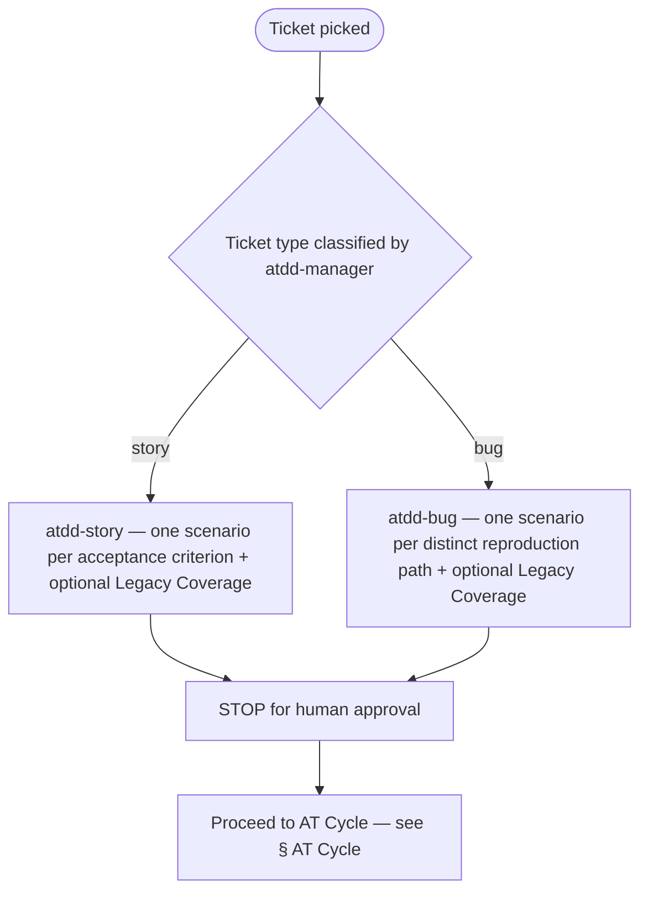
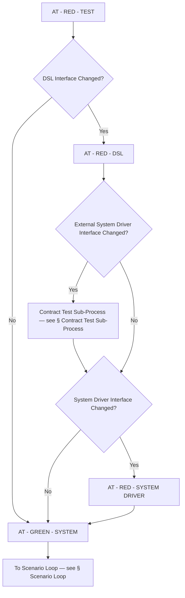
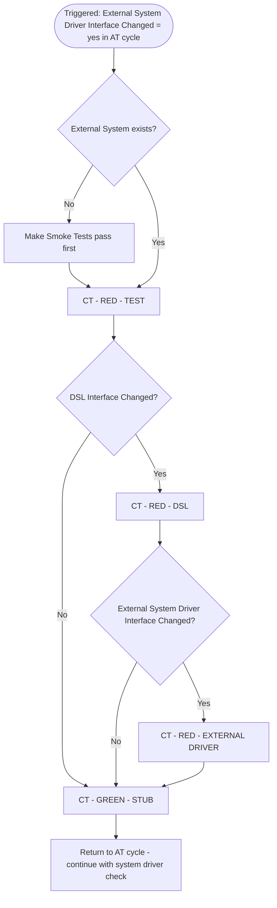
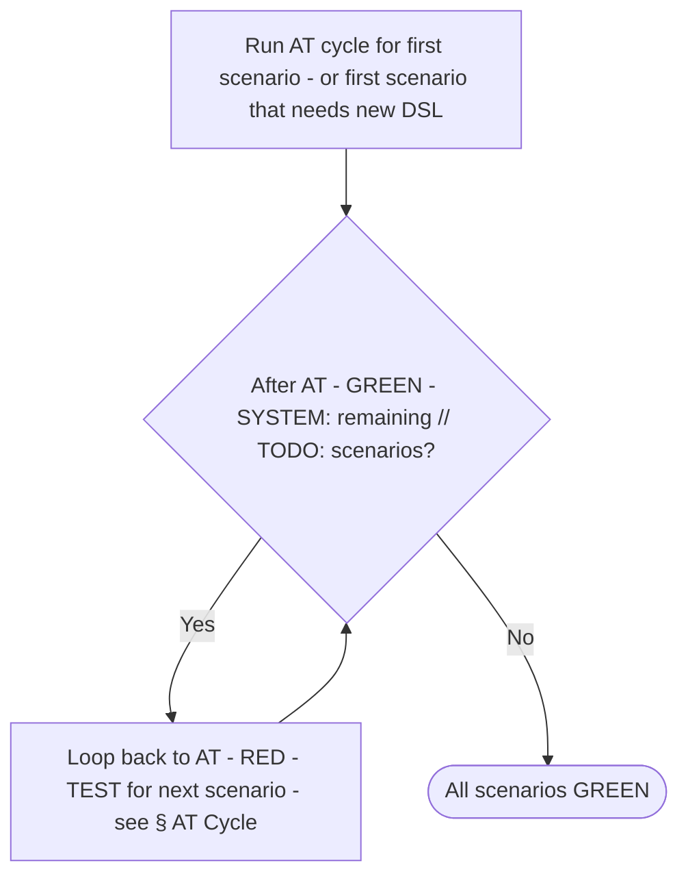

# Process Diagram

> Generated by the `diagram-generator` agent from the prose docs in `docs/atdd/process/`. Overwritten on every run — do not edit by hand; edit the source docs and regenerate.

## Source docs

- `docs/atdd/process/acceptance-tests.md`
- `docs/atdd/process/contract-tests.md`
- `docs/atdd/process/glossary.md`
- `docs/atdd/process/orchestrator.md`

## Overview



## Intake



## AT Cycle



## AT - RED - TEST Phase Detail

```mermaid
flowchart TD
    WRITE[AT - RED - TEST - WRITE: write tests, attempt compile]
    COMPILE{Compile succeeds?}
    KEEP_ALL[Keep all written tests as real methods]
    KEEP_ONE[Keep exactly one real test - first scenario; convert others to // TODO: comments]
    RUN_FAIL[Run tests; verify they fail]
    STOP_WRITE[STOP — present to user for approval]
    HAS_COMPILE_ERR{Compile-time errors in WRITE?}
    EXTEND_DSL[Extend DSL interfaces with new methods; throw 'TODO: DSL']
    RUN_RUNTIME[Run tests; verify runtime failure]
    DISABLE[Mark tests disabled with reason 'AT - RED - TEST']
    COMMIT[COMMIT: Scenario | AT - RED - TEST]
    STOP_END[STOP — phase progression controlled by orchestrator]

    WRITE --> COMPILE
    COMPILE -->|Yes| KEEP_ALL
    COMPILE -->|No| KEEP_ONE
    KEEP_ALL --> RUN_FAIL
    KEEP_ONE --> RUN_FAIL
    RUN_FAIL --> STOP_WRITE
    STOP_WRITE --> HAS_COMPILE_ERR
    HAS_COMPILE_ERR -->|Yes| EXTEND_DSL
    EXTEND_DSL --> RUN_RUNTIME
    RUN_RUNTIME --> DISABLE
    HAS_COMPILE_ERR -->|No| DISABLE
    DISABLE --> COMMIT
    COMMIT --> STOP_END
```

## AT - RED - DSL Phase Detail

```mermaid
flowchart TD
    ENABLE[Enable tests disabled with reason 'AT - RED - TEST']
    IMPL_DSL[Implement DSL for real - replace 'TODO: DSL' stub]
    UPDATE_DRIVER_IFACE[Update Driver interfaces as needed]
    CHECK_EXT[Set flag: External System Driver Interface Changed = yes/no]
    CHECK_SYS[Set flag: System Driver Interface Changed = yes/no]
    STOP_WRITE[STOP — present DSL, Driver changes, both flags for approval]
    IMPL_DRIVERS_STUB[Implement Drivers by throwing 'TODO: Driver']
    RUN_RUNTIME[Run tests; verify runtime failure]
    DISABLE[Mark tests disabled with reason 'AT - RED - DSL']
    NO_TEST_FILES[Ensure no test files in changed files list]
    COMMIT[COMMIT: Scenario | AT - RED - DSL]
    GH_COMMENT[If issue number provided, post DSL changes summary on issue]
    PROCEED[Proceed to AT - RED - SYSTEM DRIVER - WRITE]

    ENABLE --> IMPL_DSL
    IMPL_DSL --> UPDATE_DRIVER_IFACE
    UPDATE_DRIVER_IFACE --> CHECK_EXT
    CHECK_EXT --> CHECK_SYS
    CHECK_SYS --> STOP_WRITE
    STOP_WRITE --> IMPL_DRIVERS_STUB
    IMPL_DRIVERS_STUB --> RUN_RUNTIME
    RUN_RUNTIME --> DISABLE
    DISABLE --> NO_TEST_FILES
    NO_TEST_FILES --> COMMIT
    COMMIT --> GH_COMMENT
    GH_COMMENT --> PROCEED
```

## AT - RED - SYSTEM DRIVER Phase Detail

```mermaid
flowchart TD
    ENABLE[Enable tests disabled with reason 'AT - RED - DSL']
    IMPL[Implement Drivers under shop/ - replace 'TODO: Driver' stub]
    NOTE_EXTERNAL[Do NOT implement drivers under external/ - handled by CT sub-process]
    NOTE_NO_SOURCE[Do NOT read backend/frontend source - model on existing driver methods]
    RUN[Run tests; verify runtime failure]
    STOP_WRITE[STOP — present Driver implementation for approval]
    DISABLE[Mark tests disabled with reason 'AT - RED - SYSTEM DRIVER']
    NO_TEST_FILES[Ensure no test files in changed files]
    COMMIT[COMMIT: Scenario | AT - RED - SYSTEM DRIVER]
    GH_COMMENT[If issue number provided, post Driver changes summary on issue]
    STOP_END[STOP — phase progression controlled by orchestrator]

    ENABLE --> IMPL
    IMPL --> NOTE_EXTERNAL
    NOTE_EXTERNAL --> NOTE_NO_SOURCE
    NOTE_NO_SOURCE --> RUN
    RUN --> STOP_WRITE
    STOP_WRITE --> DISABLE
    DISABLE --> NO_TEST_FILES
    NO_TEST_FILES --> COMMIT
    COMMIT --> GH_COMMENT
    GH_COMMENT --> STOP_END
```

## AT - GREEN - SYSTEM Phase Detail

```mermaid
flowchart TD
    BACKEND[Implement backend changes]
    RUN_API[Run acceptance tests for API channel]
    API_PASS{API tests pass?}
    FIX_BACKEND[Fix backend code only - do NOT change tests/dsl/drivers]
    FRONTEND[Implement frontend changes]
    RUN_UI[Run acceptance tests for UI channel]
    UI_PASS{UI tests pass?}
    FIX_FRONTEND[Fix frontend code only - do NOT change tests/dsl/drivers]
    STOP_WRITE[STOP — present implementation for approval]
    COMMIT_SYS[COMMIT: Scenario | AT - GREEN - SYSTEM - backend + frontend changes]
    REMOVE_DISABLED[Remove disabled annotation reason 'AT - RED - SYSTEM DRIVER']
    RUN_VERIFY[Run all tests; verify they pass]
    COMMIT_TESTS[COMMIT: Scenario | AT - GREEN - SYSTEM - test changes only]
    GH_TICK[Tick acceptance criterion checkbox; if all ticked move issue to In Review]
    LOOP_BACK[If remaining // TODO: scenarios, return to AT - RED - TEST - WRITE]

    BACKEND --> RUN_API
    RUN_API --> API_PASS
    API_PASS -->|No| FIX_BACKEND
    FIX_BACKEND --> RUN_API
    API_PASS -->|Yes| FRONTEND
    FRONTEND --> RUN_UI
    RUN_UI --> UI_PASS
    UI_PASS -->|No| FIX_FRONTEND
    FIX_FRONTEND --> RUN_UI
    UI_PASS -->|Yes| STOP_WRITE
    STOP_WRITE --> COMMIT_SYS
    COMMIT_SYS --> REMOVE_DISABLED
    REMOVE_DISABLED --> RUN_VERIFY
    RUN_VERIFY --> COMMIT_TESTS
    COMMIT_TESTS --> GH_TICK
    GH_TICK --> LOOP_BACK
```

## Contract Test Sub-Process



## CT - RED - TEST Phase Detail

```mermaid
flowchart TD
    WRITE[CT - RED - TEST - WRITE: write External System Contract Tests]
    RUN_REAL[Run against Real External System]
    REAL_PASS{Tests pass?}
    ASK_USER[Ask user for support; STOP]
    RUN_STUB[Run against Stub External System]
    STUB_FAIL{Tests fail?}
    DISABLE[Mark tests disabled with reason 'CT - RED - TEST']
    STOP_WRITE[STOP — present contract tests for approval]
    HAS_COMPILE_ERR{Compile-time errors in WRITE?}
    EXTEND_DSL[Extend DSL interfaces; throw 'TODO: DSL']
    RUN_RUNTIME[Run tests; verify runtime failure]
    COMMIT[COMMIT: Scenario | CT - RED - TEST]
    STOP_END[STOP — phase progression controlled by orchestrator]

    WRITE --> RUN_REAL
    RUN_REAL --> REAL_PASS
    REAL_PASS -->|No| ASK_USER
    REAL_PASS -->|Yes| RUN_STUB
    RUN_STUB --> STUB_FAIL
    STUB_FAIL -->|Yes| DISABLE
    STUB_FAIL -->|No| ASK_USER
    DISABLE --> STOP_WRITE
    STOP_WRITE --> HAS_COMPILE_ERR
    HAS_COMPILE_ERR -->|Yes| EXTEND_DSL
    EXTEND_DSL --> RUN_RUNTIME
    RUN_RUNTIME --> COMMIT
    HAS_COMPILE_ERR -->|No| COMMIT
    COMMIT --> STOP_END
```

## CT - RED - DSL Phase Detail

```mermaid
flowchart TD
    ENABLE[Enable tests disabled with reason 'CT - RED - TEST']
    IMPL_DSL[Implement DSL for real - replace 'TODO: DSL' stub]
    UPDATE_DRIVER_IFACE[Update Driver interfaces as needed]
    CHECK_EXT[Set flag: External System Driver Interface Changed = yes/no - no recursive triggering]
    STOP_WRITE[STOP — present DSL, Driver changes, flag for approval]
    IMPL_DRIVERS_STUB[Implement Drivers by throwing 'TODO: Driver']
    RUN_RUNTIME[Run tests against suite-contract-stub; verify runtime failure]
    DISABLE[Mark tests disabled with reason 'CT - RED - DSL']
    COMMIT[COMMIT: Scenario | CT - RED - DSL]
    GH_COMMENT[If issue number provided, post DSL changes summary on issue]
    PROCEED[Proceed to CT - RED - EXTERNAL DRIVER - WRITE]

    ENABLE --> IMPL_DSL
    IMPL_DSL --> UPDATE_DRIVER_IFACE
    UPDATE_DRIVER_IFACE --> CHECK_EXT
    CHECK_EXT --> STOP_WRITE
    STOP_WRITE --> IMPL_DRIVERS_STUB
    IMPL_DRIVERS_STUB --> RUN_RUNTIME
    RUN_RUNTIME --> DISABLE
    DISABLE --> COMMIT
    COMMIT --> GH_COMMENT
    GH_COMMENT --> PROCEED
```

## CT - RED - EXTERNAL DRIVER Phase Detail

```mermaid
flowchart TD
    ENABLE[Enable tests disabled with reason 'CT - RED - DSL']
    IMPL[Implement Drivers under external/ only - replace 'TODO: Driver' stub]
    RUN[Run tests; verify runtime failure]
    STOP_WRITE[STOP — present Driver implementation for approval]
    DISABLE[Mark tests disabled with reason 'CT - RED - EXTERNAL DRIVER']
    COMMIT[COMMIT: Scenario | CT - RED - EXTERNAL DRIVER]
    GH_COMMENT[If issue number provided, post Driver changes summary on issue]
    STOP_END[STOP — phase progression controlled by orchestrator]

    ENABLE --> IMPL
    IMPL --> RUN
    RUN --> STOP_WRITE
    STOP_WRITE --> DISABLE
    DISABLE --> COMMIT
    COMMIT --> GH_COMMENT
    GH_COMMENT --> STOP_END
```

## CT - GREEN - STUBS Phase Detail

```mermaid
flowchart TD
    ENABLE[Enable tests disabled with reason 'CT - RED - EXTERNAL DRIVER']
    IMPL_STUBS[Implement External System Stubs]
    RUN[Run External System Contract Tests against suite-contract-stub]
    PASS{Tests pass?}
    ASK_USER[Ask user; STOP]
    STOP_WRITE[STOP — present stub implementation for approval]
    REMOVE_DISABLED[Remove disabled annotation reason 'CT - RED - EXTERNAL DRIVER']
    RUN_VERIFY[Run tests; verify they pass]
    COMMIT[COMMIT: Scenario | CT - GREEN - STUBS]
    STOP_END[STOP — phase progression controlled by orchestrator]

    ENABLE --> IMPL_STUBS
    IMPL_STUBS --> RUN
    RUN --> PASS
    PASS -->|No| ASK_USER
    PASS -->|Yes| STOP_WRITE
    STOP_WRITE --> REMOVE_DISABLED
    REMOVE_DISABLED --> RUN_VERIFY
    RUN_VERIFY --> COMMIT
    COMMIT --> STOP_END
```

## Scenario Loop



## Notes

- `orchestrator.md` shows the AT cycle's external-driver branch as `External System Driver Interface Changed? — Yes → Contract Test Sub-Process → (then continue ↓)` returning into the System Driver Interface check. The AT Cycle diagram routes the CT return edge into the `System Driver Interface Changed?` decision to match this prose; the No branch from `External System Driver Interface Changed?` flows into the same decision.
- `contract-tests.md` step 2 in CT - RED - TEST says "If they don't pass, ask the user for support. STOP." for the Real run, but for the Stub run only states "Verify that they fail" without an explicit branch for the unexpected case (Stub tests passing). The CT - RED - TEST detail diagram routes that anomaly to `ASK_USER` for completeness; this is an inferred edge.
- The Scenario Loop's "first scenario that needs new DSL" wording is taken verbatim from `orchestrator.md`. `acceptance-tests.md` orders scenarios as Legacy Coverage → existing-DSL → new-DSL, which is structurally consistent but uses different wording.
