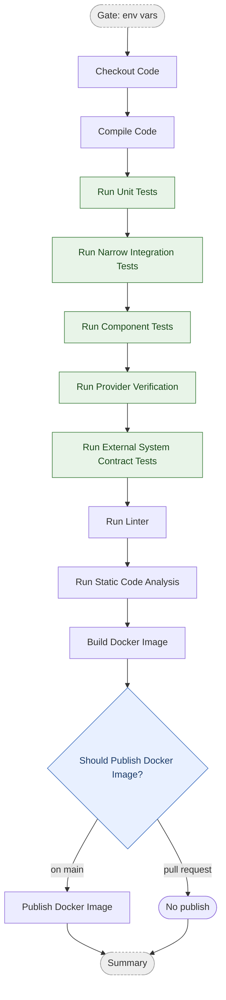

# Commit Stage

The commit stage runs on every push and pull request. It compiles the code, runs
the fast test layers, checks quality, and builds a Docker image — publishing it
only when the commit is on `main`.

This diagram shows the **conceptual** stages. The real workflow YAML has more steps
(setup, pre-warm, retry, registry login, metadata), each of which belongs to the
conceptual box it supports — see [Diagram ↔ YAML mapping](#diagram--yaml-mapping).

## Pipeline

- **Gate** and **Summary** are orchestration jobs, not pipeline stages.
- **Publish Docker Image** runs only on `main`; pull requests build the image but do not push it.
- **The test pyramid gates the image.** The suites (unit · narrow integration · component · provider-verification · external-contract, green above) run **inside the `run` job**, in pyramid order, **ahead of Build/Publish** — each invoked as `gh optivem component-test run [--component <c>] --suite <id>` against the declarative `component-tests.yaml`. A red suite blocks the Docker image; there is no longer a separate, non-gating `component-tests` job. Pending suites print a notice and pass; Docker-backed suites require the Docker daemon (provided on `ubuntu-latest`). The **frontend** runs unit · integration · component only — it is consumer-only, talks to no external system directly, and so has **no** provider-verification and **no** external-contract suite. `external-contract` is **backend-java only** so far; `backend-dotnet` and `backend-typescript` still keep those tests inside `component`.
- **Narrow integration** exercises one adapter against a real dependency in isolation — no component boot, no full app start. Backends: `OrderRepository` ↔ Testcontainers-Postgres, `TaxGateway`/`ErpGateway` ↔ WireMock-in-Testcontainers. Frontend: `orderService` adapter ↔ in-process Pact mock server (no React render, no Docker). See [test taxonomy](../atdd/test-taxonomy.md) for the scope and counterparty discriminators.
- **Consumer → `contracts/` → provider verification flow:** the frontend `integration` + `component` suites both emit into the committed `contracts/frontend-backend.json` (union of both suites' interactions); the backend `provider-verification` suite reads that committed file and runs provider verification. No inter-job artifact passing — the committed `.pact` is always current. `requiresDocker: false` on the backend provider-verification suite (provider verification uses WireMock + WebApplicationFactory, not Testcontainers).
- **The two contract suites split by counterparty.** `Provider Verification (Pact)` (`id: provider-verification`) runs the backend's `BackendPactVerificationTest`, verifying the frontend consumer's committed `.pact` against the real provider — an **internal** counterparty, one we control both ends of. `External System Contract` (`id: external-contract`) covers counterparties that will **not** replay our pact file (clock/erp/tax), pinning agreement with stub-vs-real parity pairs and stub-consumability tests instead. Both exist **only on backends** — the frontend is consumer-only, and its consumer-contract emission lives in the `integration` + `component` suites. On backend-java both run on the Gradle `contractTest` task, separated by package (`contract.*.internal.*` vs `contract.*.external.*`). Distinct again from the external-system contract *system* tests in `tests.yaml`, which run against a deployed system rather than in-process.
- **Local vs CI:** `gh optivem component-test run` is the command that matches the CI gate. Bare `npm test` / `./gradlew test` / `dotnet test` run a fast, Docker-light subset and intentionally run *less* than CI. Use `--suite unit` for the fast inner loop, bare `run` to match CI.

## Diagram ↔ YAML mapping

Alignment covers the **`run` job only** — each conceptual box absorbs the supporting
YAML steps below it so the diagram can be diffed against the YAML. Two marker styles:
stage boxes use `# === <Stage> ===` headers; decision diamonds (gates) use
`# <> <Decision?> <>`. The `check` (env-vars) and `summary` jobs are orchestration and
are not part of the alignment.

| Diagram box | YAML steps |
|---|---|
| Checkout Code | Checkout Repository (`run` job) |
| Compile Code | Setup toolchain, pre-warm, Compile Code (`run` job) |
| Run Unit Tests | Install gh-optivem CLI Extension, Set Up Component Test Harness, Run Unit Tests (`gh optivem component-test run --suite unit`, `run` job) |
| Run Narrow Integration Tests | Run Narrow Integration Tests (`gh optivem component-test run --suite integration`, `run` job) |
| Run Component Tests | Run Component Tests (`gh optivem component-test run --suite component`, `run` job) |
| Run Provider Verification | Run Provider Verification (`gh optivem component-test run --suite provider-verification`, `run` job; backends + monolith only — frontend is consumer-only) |
| Run External System Contract Tests | Run External System Contract Tests (`gh optivem component-test run --suite external-contract`, `run` job; backend-java only so far) |
| Run Linter | Run Linter (`run` job) |
| Run Static Code Analysis | Run Code Analysis (`run` job; reuses Compile Code's build output) |
| Build Docker Image | Setup Buildx, pre-pull base images, read/compose version, extract metadata (`run` job) |
| Publish Docker Image | Registry login, Build and Push (gated on `main` via Check Commit on Main), Compose Digest URL (`run` job) |

Workflows: `monolith-{dotnet,java,typescript}-commit-stage.yml`,
`multitier-backend-{dotnet,java,typescript}-commit-stage.yml`,
`multitier-frontend-react-commit-stage.yml`.
