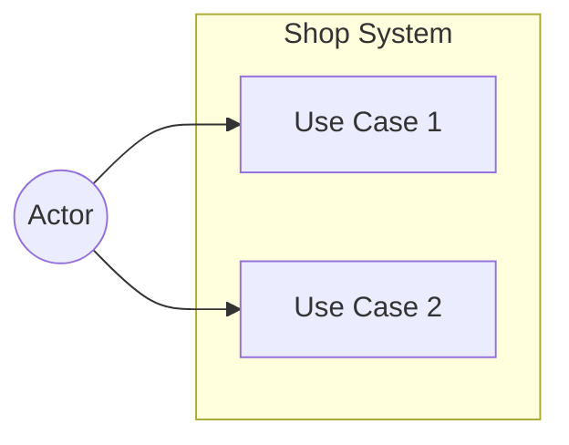

# Use Case Diagram

## Instructions

1. Replace **Actor** with the primary actor of your system (e.g. Customer, Admin, User).
2. Replace **Use Case 1**, **Use Case 2**, etc. with actual use cases.
3. Add additional actors and use cases as needed.
4. Draw arrows from actors to the use cases they interact with.
