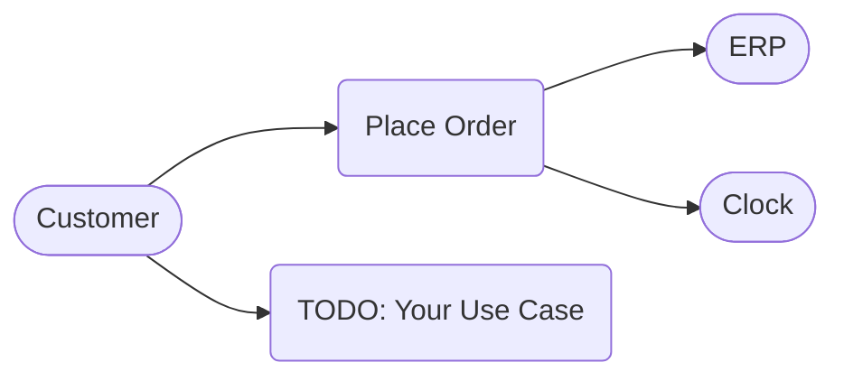

# Shop — Use Cases

## Instructions

1. Replace **Customer** with the primary actor of your system (e.g. Customer, Admin, User).
2. Replace **Place Order** and **TODO: Your Use Case** with actual use cases.
3. Add additional actors and use cases as needed.
4. Draw arrows from actors to the use cases they interact with.
5. Add secondary actors (e.g. ERP, Clock) and connect them to the relevant use cases.
